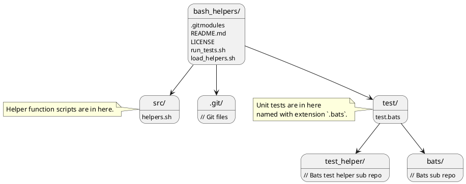

# bash_helpers

## About

Random bash helper functions to practice bash scripting.

Utilizes the [bats](https://github.com/bats-core/bats-core) project for a unit test framework.

## How To Use

Add as sub module or fork and pull into a script with a command like
`source ./bash_helpers/load_helpers.sh`

The actual helper functions available can be seen in `bash_helpers/src/*`

## How To Test

Run the script `run_tests.sh`.
Note this script will first `init` and `update` bats sub modules, 
if they have not already been set up.

You may need to make scripts executable with `chmod` like `chmod u+x ./run_tests.sh`.

## Third Party References

* [bats-core documentation](https://bats-core.readthedocs.io/en/stable/)
* [bats-core GitHub](https://github.com/bats-core/bats-core)

## Folder Structure

<!---
To render locally ensure plantuml is installed and run:
plantuml -o /media/ramdisk -tpng ./README.md
--->

Apparently GitLab supports plantuml in markdown, but GitHub does not. 
Will leave the plantuml source here and wait for GitHub to get with the program.

